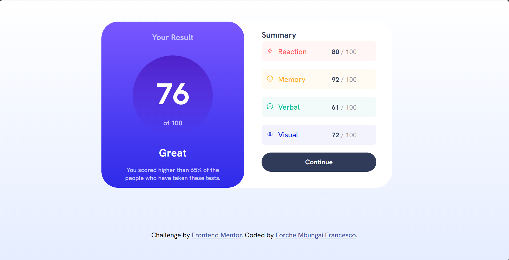

# Frontend Mentor - Results summary component solution

This is a solution to the [Results summary component challenge on Frontend Mentor](https://www.frontendmentor.io/challenges/results-summary-component-CE_K6s0maV). Frontend Mentor challenges help you improve your coding skills by building realistic projects. 

## Table of contents

- [Overview](#overview)
  - [The challenge](#the-challenge)
  - [Screenshot](#screenshot)
  - [Links](#links)
- [My process](#my-process)
  - [Built with](#built-with)
  - [What I learned](#what-i-learned)
  - [Continued development](#continued-development)
  - [Useful resources](#useful-resources)
- [Author](#author)

**Note: Delete this note and update the table of contents based on what sections you keep.**

## Overview

### The challenge

Users should be able to:

- View the optimal layout for the interface depending on their device's screen size
- See hover and focus states for all interactive elements on the page
- **Bonus**: Use the local JSON data to dynamically populate the content

### Screenshot



### Links

- Solution URL: [Add solution URL here](https://your-solution-url.com)
- Live Site URL: [Add live site URL here](https://mbungai-francesco.github.io/Results-summary-component/)

## My process

### Built with

- Semantic HTML5 markup
- CSS custom properties
- Flexbox


### What I learned

Had to learn z-indexing, in order to superpose the main divs together

```css
.right{
  z-index: 1;
}
.left{
  z-index: -1;
}
```

### Continued development

Still working on the responsiveness for this compinent. So as to make it fit on mobile devices too.

### Useful resources

- [Example resource 1](https://developer.mozilla.org/en-US/docs/Web/CSS/z-index) - This helped me for  z-indexing. Really summarised and great examples that make you understand the concept.

## Author

- github - [Forche Mbungai Francesco](https://www.your-site.com)
- Frontend Mentor - [@Mbungai-Francesco](https://www.frontendmentor.io/profile/Mbungai-Francesco)
- Twitter - [@MbungaiF](https://www.twitter.com/MbungaiF)

